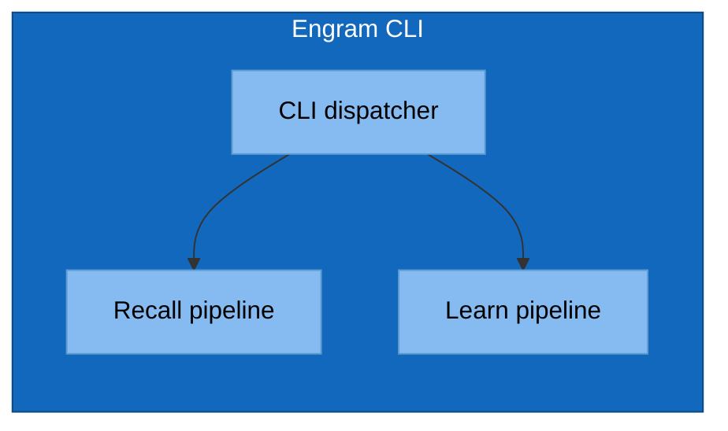
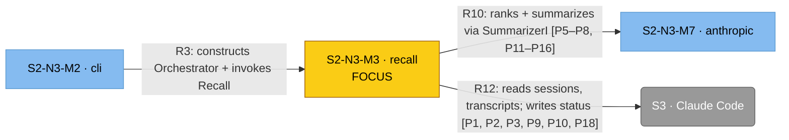
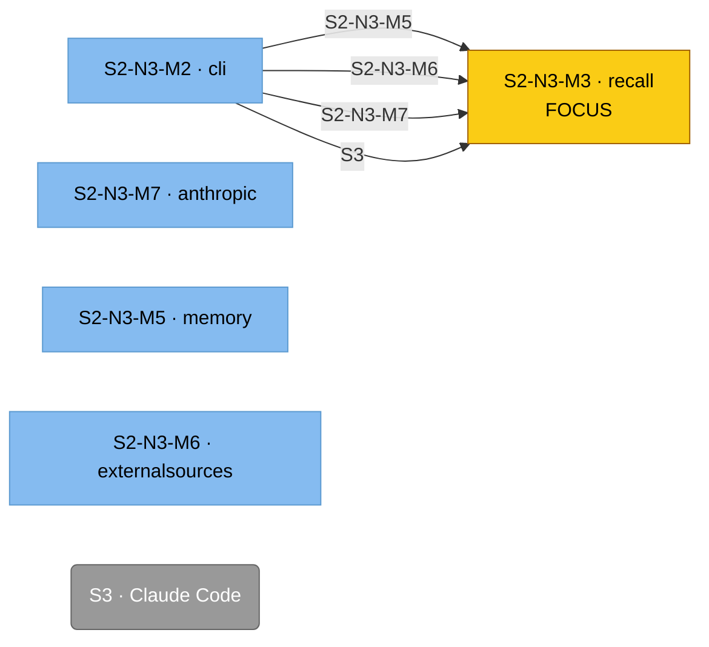

# Mermaid Conventions for C4 Diagrams

Mermaid has no native C4 shape vocabulary. The c4 skill enforces a project-wide convention
so all diagrams in `architecture/c4/` look the same.

## The Shape Convention

| C4 element | Mermaid shape | classDef class |
|---|---|---|
| Person / actor | Stadium: `id([Name])` | `:::person` |
| External system | Rounded: `id(Name)` | `:::external` |
| Internal container | Rectangle: `id[Name]` | `:::container` |
| Internal component | Subgraph inside container | `:::component` |

## The classDef Block (paste at top of every diagram)

```mermaid
flowchart LR
    classDef person      fill:#08427b,stroke:#052e56,color:#fff
    classDef external    fill:#999,   stroke:#666,   color:#fff
    classDef container   fill:#1168bd,stroke:#0b4884,color:#fff
    classDef component   fill:#85bbf0,stroke:#5d9bd1,color:#000
```

## L1 Skeleton


## L2 Skeleton

Same as L1, but `engram` expands into multiple containers (CLI binary, hooks, on-disk stores)
each shown as `:::container`.

## L3 Skeleton



## Element & Relationship IDs (and clickable anchors)

Every L1–L3 diagram is paired with two tables: an **Element Catalog** (catalog rows) and a
**Relationships** table. To make mismatches between diagram and tables eyeballable — and to
make every diagram node click through to its catalog row — the c4 skill enforces this
convention:

1. **Every catalog row has a level-scoped ID:** `S<n>` at L1, `N<n>` at L2, `M<n>` at L3.
   IDs are sequential within a diagram. Cross-doc references use the full hyphen-separated
   path (e.g., `S2-N3-M5`). Lower-level docs read their parent to find the path prefix.
2. **Every relationships row has an ID** of the form `R1`, `R2`, … (one per row, sequential).
3. **Every mermaid node label embeds its catalog ID:** `engram[N2 · Engram plugin]`. The dot
   separator is for readability; the ID prefix is the contract.
4. **Every mermaid edge label embeds its relationship ID:** `cc -->|R2: loads skills + fires hooks| engram`.
5. **Every node has a `click` directive** to its catalog row's anchor:
   ```mermaid
   click engram href "#n2-engram-plugin" "Engram plugin"
   ```
6. **Every catalog and relationships row has an HTML anchor** in its first cell so the click
   resolves on GitHub:
   ```markdown
   | <a id="n2-engram-plugin"></a>N2 | Engram plugin | The system in scope | … |
   ```

### Mismatch as drift

- A node label with a hierarchical ID that has no matching catalog row → orphan-in-diagram drift.
- A catalog row whose ID never appears in any node label → orphan-in-catalog drift.
- Same rules apply to `Rn` and edge labels.
- The skill's `review` and `audit` sub-actions report these as drift findings.

### Why edges aren't clickable

Mermaid does not support `click` on edges, only on nodes. Edge `Rn` IDs are visual cross-reference
only — the reader scans the relationships table by ID. Nodes ARE clickable; clicking a node on
GitHub jumps to its catalog row.

```mermaid
flowchart LR
    classDef person      fill:#08427b,stroke:#052e56,color:#fff
    classDef external    fill:#999,   stroke:#666,   color:#fff
    classDef container   fill:#1168bd,stroke:#0b4884,color:#fff

    user([S1 · Joe<br/>engram user])
    cc(S3 · Claude Code)
    engram[S2 · Engram]
    anth(S4 · Anthropic API)

    user -->|R1: invokes /prepare, /learn, ...| cc
    cc -->|R2: hooks + skills| engram
    engram -->|R3: memory queries| anth

    class user person
    class cc,anth external
    class engram container

    click user href "#s1-joe"
    click engram href "#s2-engram"
    click cc href "#s3-claude-code"
    click anth href "#s4-anthropic-api"
```

### Worked example (L1 — `S<n>` IDs)



| ID | Name | Type | Responsibility | Source |
|---|---|---|---|---|
| <a id="s1-joe"></a>S1 | Joe | Person | engram user | Human |
| <a id="s2-engram"></a>S2 | Engram | The system | … | This repo |
| <a id="s3-claude-code"></a>S3 | Claude Code | External system | … | Anthropic CLI |
| <a id="s4-anthropic-api"></a>S4 | Anthropic API | External system | … | api.anthropic.com |

## GitHub Mermaid Quirks

- GitHub renders mermaid blocks marked ` ```mermaid `. Don't use `mmd`, `mermaidjs`, etc.
- HTML in labels is supported for `<br/>` only. Avoid raw HTML beyond that.
- `subgraph` titles cannot contain commas in some renderers — replace with `&comma;` or omit.
- Long labels: wrap with `<br/>`, don't trust auto-wrap.
- Edge labels: always use `-->|label|` form, never `-- label -->` (the former renders consistently).

## L4: Two Diagrams (Call + Wiring)

L4 ships two `.mmd`/`.svg` pairs per focus component:

1. **Call diagram** (`<name>.mmd`) — strict C4 with `R<n>` runtime-call edges only.
2. **Wiring diagram** (`<name>-wiring.mmd`) — companion view of `wirer → focus` edges
   labelled with the wrapped-entity SNM ID.

No D-edges, no port nodes, no `W`/`A` edge namespaces. Standard C4 idiom only.

### Call diagram



Rules:

1. **R-edges only.** Edge IDs are bare `R<n>` (no letter suffixes, no other prefixes —
   `EXT1`, `X1`, `D1`, `R2a` are all rejected by `targ c4-l4-build`).
2. **Property tags on R-edges.** Each R-edge label may end with the P-IDs the call realizes:
   `R8: ... [P3, P4, P9, P10]`. Use range notation for contiguous P-runs (`[P5–P8]` not
   `[P5, P6, P7, P8]`). Authored as the `properties: ["P3", ...]` field on the L4Spec edge;
   the renderer formats the suffix.
3. **Externals required.** Every external system the focus crosses to via DI (filesystem,
   OS, Anthropic API, Claude Code, etc.) must appear as a `kind: external` node here with
   at least one R-edge from the focus to it. Carry over from the L3 parent's external set.
4. **Focus highlight.** The focus component carries the yellow `:::focus` classDef.

### Wiring diagram



Rules:

1. **Derived, not authored.** The build target groups manifest rows by
   `(wired_by_id, wrapped_entity_id)` and emits one wiring edge per group. Multiple DI
   seams sharing both wirer and wrapped entity collapse into one edge.
2. **Edge label = SNM ID of the wrapped entity.** Unadorned, no `R<n>` prefix.
3. **Strict alignment.** Every wrapped-entity node on the wiring diagram must already
   exist on the call diagram (same shape/class carries over). The wiring diagram
   introduces no new nodes; the L4 builder rejects manifests that violate this.
4. **Reciprocal manifest tables.** The consumer's L4 has a `## Dependency Manifest`
   listing each DI seam (with `wrapped_entity_id`); the wirer's L4 has a `## DI Wires`
   listing the reciprocal rows. See `property-ledger-format.md` for column schema.

### Build-time validation

`targ c4-l4-build` enforces:

- Node IDs are hierarchical (`S<n>`, `N<n>`, `M<n>`, or full path like `S2-N3-M5`) via
  `ParseIDPath`.
- Edge IDs are bare `R<n>`. D-edges, A-edges, and letter-suffixed IDs are rejected.
- Every manifest row's `wrapped_entity_id` matches some `id` on `diagram.nodes`.

Read the build error for the specific violation and fix.

## Pre-rendering to SVG (ELK layout)

GitHub's Mermaid renderer does **not** support the ELK layout engine — `@mermaid-js/layout-elk`
is not installed and the `%%{init: {'flowchart': {'defaultRenderer': 'elk'}}}%%` directive is
silently ignored. Default `dagre` collides bidirectional edges between the same node pair
(R/D pairs, mermaid-js/mermaid#4745, #5060), making the diagram unreadable.

Workaround: pre-render `.mmd` sources to `.svg` locally with `mmdc` (which honors the ELK
directive) and embed the SVG in the markdown.

### Layout

```
architecture/c4/
├── c1-engram-system.md           # markdown links to svg/c1-engram-system.svg
├── c2-engram-plugin.md
├── c3-engram-cli-binary.md
├── c4-tokenresolver.md
└── svg/
    ├── c1-engram-system.mmd      # source (with ELK init directive)
    ├── c1-engram-system.svg      # rendered output (committed)
    ├── c2-engram-plugin.mmd
    ├── ...
```

### .mmd source preamble

Every `.mmd` source starts with the ELK init directive (it's a no-op on GitHub but mmdc honors it):

```
%%{init: {'flowchart': {'defaultRenderer': 'elk'}}}%%
flowchart LR
    ...
```

### .md embed snippet

Each markdown file replaces what would have been an inline ` ```mermaid ` block with:

```


> Diagram source: [svg/<file-stem>.mmd](svg/<file-stem>.mmd). Re-render with `targ c4-render`
> (or `npx @mermaid-js/mermaid-cli -i ... -o ...` directly).
> Pre-rendered because GitHub's Mermaid lacks the ELK layout engine, which is needed to
> lay out R-edges cleanly.
```

### Render command

`targ c4-render` walks `architecture/c4/svg/`, runs `npx @mermaid-js/mermaid-cli` for any
`.mmd` whose `.svg` is missing or older, and prints a summary. Use `--force` to re-render
everything.

Click handlers in mermaid (`click foo href "#anchor"`) do not carry through the static SVG
render; in-page anchors in the catalog tables still work for navigation.
