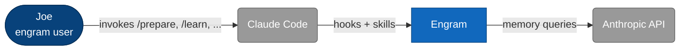
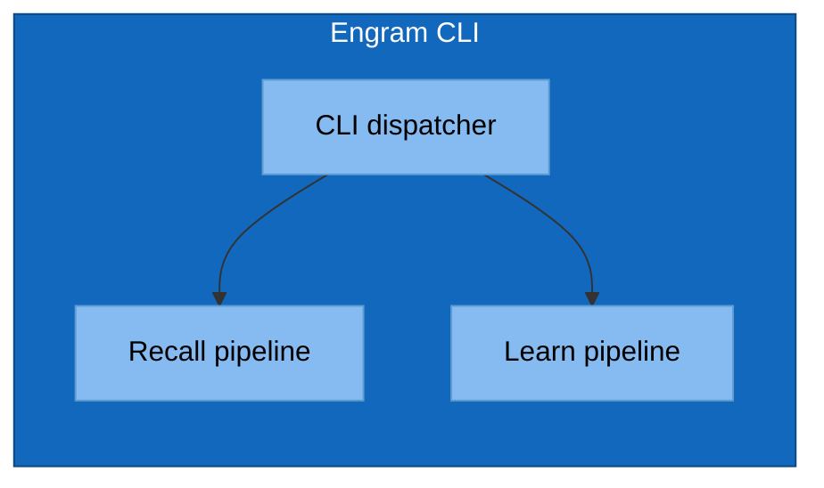
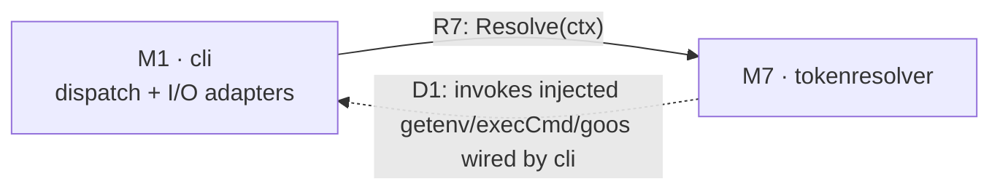
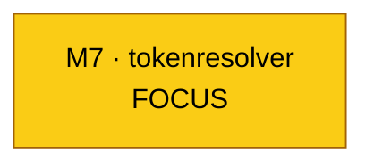

# Mermaid Conventions for C4 Diagrams

Mermaid has no native C4 shape vocabulary. The c4 skill enforces a project-wide convention
so all diagrams in `architecture/c4/` look the same.

## The Shape Convention

| C4 element | Mermaid shape | classDef class |
|---|---|---|
| Person / actor | Stadium: `id([Name])` | `:::person` |
| External system | Rounded: `id(Name)` | `:::external` |
| Internal container | Rectangle: `id[Name]` | `:::container` |
| Internal component | Subgraph inside container | `:::component` |

## The classDef Block (paste at top of every diagram)

```mermaid
flowchart LR
    classDef person      fill:#08427b,stroke:#052e56,color:#fff
    classDef external    fill:#999,   stroke:#666,   color:#fff
    classDef container   fill:#1168bd,stroke:#0b4884,color:#fff
    classDef component   fill:#85bbf0,stroke:#5d9bd1,color:#000
```

## L1 Skeleton



## L2 Skeleton

Same as L1, but `engram` expands into multiple containers (CLI binary, hooks, on-disk stores)
each shown as `:::container`.

## L3 Skeleton



## Element & Relationship IDs (and clickable anchors)

Every L1–L3 diagram is paired with two tables: an **Element Catalog** (catalog rows) and a
**Relationships** table. To make mismatches between diagram and tables eyeballable — and to
make every diagram node click through to its catalog row — the c4 skill enforces this
convention:

1. **Every catalog row has a level-scoped ID:** `S<n>` at L1, `N<n>` at L2, `M<n>` at L3.
   IDs are sequential within a diagram. Cross-doc references use the full hyphen-separated
   path (e.g., `S2-N3-M5`). Lower-level docs read their parent to find the path prefix.
2. **Every relationships row has an ID** of the form `R1`, `R2`, … (one per row, sequential).
3. **Every mermaid node label embeds its catalog ID:** `engram[N2 · Engram plugin]`. The dot
   separator is for readability; the ID prefix is the contract.
4. **Every mermaid edge label embeds its relationship ID:** `cc -->|R2: loads skills + fires hooks| engram`.
5. **Every node has a `click` directive** to its catalog row's anchor:
   ```mermaid
   click engram href "#n2-engram-plugin" "Engram plugin"
   ```
6. **Every catalog and relationships row has an HTML anchor** in its first cell so the click
   resolves on GitHub:
   ```markdown
   | <a id="n2-engram-plugin"></a>N2 | Engram plugin | The system in scope | … |
   ```

### Mismatch as drift

- A node label with a hierarchical ID that has no matching catalog row → orphan-in-diagram drift.
- A catalog row whose ID never appears in any node label → orphan-in-catalog drift.
- Same rules apply to `Rn` and edge labels.
- The skill's `review` and `audit` sub-actions report these as drift findings.

### Why edges aren't clickable

Mermaid does not support `click` on edges, only on nodes. Edge `Rn` IDs are visual cross-reference
only — the reader scans the relationships table by ID. Nodes ARE clickable; clicking a node on
GitHub jumps to its catalog row.

### Worked example (L1 — `S<n>` IDs)


| ID | Name | Type | Responsibility | System of Record |
|---|---|---|---|---|
| <a id="s1-joe"></a>S1 | Joe | Person | engram user | Human |
| <a id="s2-engram"></a>S2 | Engram | The system | … | This repo |
| <a id="s3-claude-code"></a>S3 | Claude Code | External system | … | Anthropic CLI |
| <a id="s4-anthropic-api"></a>S4 | Anthropic API | External system | … | api.anthropic.com |

## GitHub Mermaid Quirks

- GitHub renders mermaid blocks marked ` ```mermaid `. Don't use `mmd`, `mermaidjs`, etc.
- HTML in labels is supported for `<br/>` only. Avoid raw HTML beyond that.
- `subgraph` titles cannot contain commas in some renderers — replace with `&comma;` or omit.
- Long labels: wrap with `<br/>`, don't trust auto-wrap.
- Edge labels: always use `-->|label|` form, never `-- label -->` (the former renders consistently).

## DI Back-Edge Convention (D[n])

Standard C4 has no canonical way to render dependency injection. Engram adopts a project-specific
convention: when component B has a dependency wired by component C, draw a **dotted** edge `B → C`
labelled `D[n]`. This represents "B initiates a category of calls whose concrete targets are
determined by C (the wirer)." It coexists with any direct-call `R[n]` edge B already has.



Rules:

1. **D-namespace is separate from R-namespace.** `R1, R2, …` for direct calls, `D1, D2, …` for
   DI back-edges. Both spaces start at 1 within a diagram.
2. **One D-id per (consumer, wirer) pair**, regardless of how many concrete deps. The per-dep
   decomposition lives in the L4 Dependency Manifest table — never enumerate deps on the L3 edge.
3. **Dotted arrow syntax:** `e27 -.->|"D1: ..."| e21`. Solid arrows are reserved for direct
   call edges (R[n]).
4. **Reciprocal at L4:** the consumer's L4 ledger has a Dependency Manifest table; the wirer's
   L4 ledger has a DI Wires table. Both must list the same deps; they're cross-references for
   each other (see `property-ledger-format.md`).
5. **Edge labels can cite supporting properties:** `D1: ...<br/>supported by: P1–P8`. Use range
   notation for contiguous P-runs (P1–P5 not P1, P2, P3, P4, P5).

A C4-trained reader will read a normal solid arrow as "A initiates the interaction with B."
Dotted D-edges deviate from that, so always pair the convention with a Legend (in L4 ledger
files) or rely on the reader to recognize the label prefix.

## L4 Focus Highlight

In L4 context-strip diagrams, the focus component gets a yellow `:::focus` classDef so the
subject is visible at a glance:



L4 diagrams contain only L3-present elements (no synthetic externals invented at L4). DI
callbacks land back on the L3 element that wired the dep, not on the wired-through external.

Enforced at build time by `targ c4-l4-build`: it validates diagram node ids using `ParseIDPath`
(hierarchical IDs only — `S<n>`, `N<n>`, `M<n>`, or full path like `S2-N3-M5`) and edge ids
outside bare `R<n>` (call) or `D<n>` (DI back-edge) — no letter suffixes (`R2a`, `Rjq`), no
other prefixes (`EXT1`, `X1`). Read the build error for the specific violation and fix.

## Pre-rendering to SVG (ELK layout)

GitHub's Mermaid renderer does **not** support the ELK layout engine — `@mermaid-js/layout-elk`
is not installed and the `%%{init: {'flowchart': {'defaultRenderer': 'elk'}}}%%` directive is
silently ignored. Default `dagre` collides bidirectional edges between the same node pair
(R/D pairs, mermaid-js/mermaid#4745, #5060), making the diagram unreadable.

Workaround: pre-render `.mmd` sources to `.svg` locally with `mmdc` (which honors the ELK
directive) and embed the SVG in the markdown.

### Layout

```
architecture/c4/
├── c1-engram-system.md           # markdown links to svg/c1-engram-system.svg
├── c2-engram-plugin.md
├── c3-engram-cli-binary.md
├── c4-tokenresolver.md
└── svg/
    ├── c1-engram-system.mmd      # source (with ELK init directive)
    ├── c1-engram-system.svg      # rendered output (committed)
    ├── c2-engram-plugin.mmd
    ├── ...
```

### .mmd source preamble

Every `.mmd` source starts with the ELK init directive (it's a no-op on GitHub but mmdc honors it):

```
%%{init: {'flowchart': {'defaultRenderer': 'elk'}}}%%
flowchart LR
    ...
```

### .md embed snippet

Each markdown file replaces what would have been an inline ` ```mermaid ` block with:

```


> Diagram source: [svg/<file-stem>.mmd](svg/<file-stem>.mmd). Re-render with `targ c4-render`
> (or `npx @mermaid-js/mermaid-cli -i ... -o ...` directly).
> Pre-rendered because GitHub's Mermaid lacks the ELK layout engine, which is needed to
> separate bidirectional R/D edges between the same node pair.
```

### Render command

`targ c4-render` walks `architecture/c4/svg/`, runs `npx @mermaid-js/mermaid-cli` for any
`.mmd` whose `.svg` is missing or older, and prints a summary. Use `--force` to re-render
everything.

Click handlers in mermaid (`click foo href "#anchor"`) do not carry through the static SVG
render; in-page anchors in the catalog tables still work for navigation.
