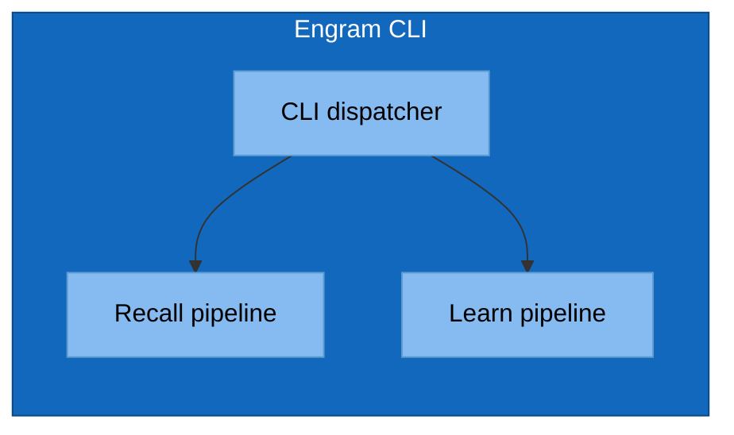

# Mermaid Conventions for C4 Diagrams

Mermaid has no native C4 shape vocabulary. The c4 skill enforces a project-wide convention
so all diagrams in `architecture/c4/` look the same.

## The Shape Convention

| C4 element | Mermaid shape | classDef class |
|---|---|---|
| Person / actor | Stadium: `id([Name])` | `:::person` |
| External system | Rounded: `id(Name)` | `:::external` |
| Internal container | Rectangle: `id[Name]` | `:::container` |
| Internal component | Subgraph inside container | `:::component` |

## The classDef Block (paste at top of every diagram)

```mermaid
flowchart LR
    classDef person      fill:#08427b,stroke:#052e56,color:#fff
    classDef external    fill:#999,   stroke:#666,   color:#fff
    classDef container   fill:#1168bd,stroke:#0b4884,color:#fff
    classDef component   fill:#85bbf0,stroke:#5d9bd1,color:#000
```

## L1 Skeleton


## L2 Skeleton

Same as L1, but `engram` expands into multiple containers (CLI binary, hooks, on-disk stores)
each shown as `:::container`.

## L3 Skeleton



## GitHub Mermaid Quirks

- GitHub renders mermaid blocks marked ` ```mermaid `. Don't use `mmd`, `mermaidjs`, etc.
- HTML in labels is supported for `<br/>` only. Avoid raw HTML beyond that.
- `subgraph` titles cannot contain commas in some renderers — replace with `&comma;` or omit.
- Long labels: wrap with `<br/>`, don't trust auto-wrap.
- Edge labels: always use `-->|label|` form, never `-- label -->` (the former renders consistently).
