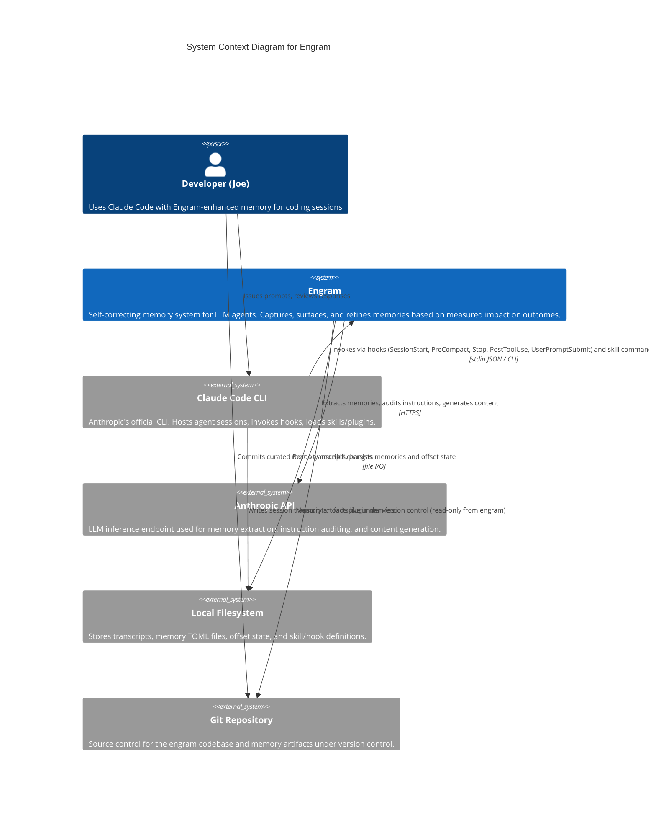

# RED Baseline (No Skill Loaded)

Captured: 2026-04-25
Subagent: general-purpose (Agent tool, fresh dispatch from controller)
Tool uses by subagent: 0 (responded from internal/CLAUDE.md context only; did NOT read repo source)

The subagent was instructed: do NOT invoke any C4 skill, do NOT read repo source code,
respond from general knowledge only — this is a baseline behavioral capture.

---

# C4 Level 1: System Context — Engram

## Overview

**Engram** is a memory subsystem for LLM coding agents. Unlike frequency-based memory tools, Engram measures whether a memory actually improved outcomes — memories that don't help get diagnosed, refined, or retired.

## Actors and External Systems

| Element | Type | Responsibility |
|---|---|---|
| Developer (Joe) | Person | Primary user; runs Claude Code sessions, curates memories |
| Claude Code CLI | External System | Agent host; invokes Engram via hooks and skill commands |
| Anthropic API | External System | LLM inference for extraction, auditing, generation |
| Local Filesystem | External System | Transcript files, memory TOML, offset state JSON |
| Git Repository | External System | Version control for memory artifacts and source |

## Key Interactions

1. **Hook-driven capture**: Claude Code invokes Engram hooks at lifecycle events (SessionStart, PreCompact, Stop, PostToolUse, UserPromptSubmit) via stdin JSON.
2. **Skill-driven workflows**: Engram ships skills (`learn`, `prepare`, `recall`, `remember`) that Claude Code loads as plugin commands.
3. **Incremental extraction**: Engram reads transcript deltas (using offset tracking), strips noise, and calls the Anthropic API to extract durable memories.
4. **Surfacing**: Engram returns `systemMessage` + `additionalContext` JSON back to Claude Code under per-hook token budgets.

## Cross-Links to Level 2 (Container Diagram)

Expected L2 decomposition — see sibling diagrams when authored:

- [`./c2-engram-containers.md`](./c2-engram-containers.md) — overall container view
- [`./c2-cli-binary.md`](./c2-cli-binary.md) — `cmd/engram` CLI binary container
- [`./c2-hooks.md`](./c2-hooks.md) — shell hook scripts container (`hooks/`)
- [`./c2-skills.md`](./c2-skills.md) — skill definitions container (`skills/`)
- [`./c2-memory-store.md`](./c2-memory-store.md) — on-disk memory + offset store container
- [`./c2-anthropic-client.md`](./c2-anthropic-client.md) — Anthropic API client container

## Notes

- Engram is **pure Go, no CGO**. Vector similarity uses TF-IDF locally; semantic operations route to the Anthropic API.
- All I/O is dependency-injected at the edges; the core has no direct `os.*` or `http.*` calls.
- The plugin manifest lives at `.claude-plugin/plugin.json`; hooks at `hooks/hooks.json`.

---

## Gap Analysis (vs. c4 skill conventions)

The skill, when written, must improve on these observed gaps:

1. **Mermaid syntax mismatch (gap #1):** Uses mermaid's native `C4Context` syntax (Person/System/System_Ext/Rel). The project convention is `flowchart` + custom classDef block (`:::person`, `:::external`, `:::container`). Render compatibility on GitHub differs and the visual style is inconsistent with what the skill specifies.
2. **No relationships table (gap #3):** Relationships are embedded inside the mermaid block; no separate markdown table with From / To / Description / Protocol columns.
3. **No drift notes section (gap #4):** No mechanism to record code-vs-intent gaps deferred at edit time.
4. **No real code-grounding (gap #6):** Subagent ran 0 tools; produced content from internal CLAUDE.md context, not from reading `cmd/engram`, `internal/`, hooks, or skills directly. Claims about hook events, package structure, and architectural rules are plausible but unverified by the agent.
5. **Partial element catalog (gap #2):** A catalog table exists but lacks the skill's "System of Record" column.
6. **Cross-links use invented filenames:** Cross-links list 6 plausible L2 files, but the names are speculation; they don't match any real plan or existing artifact.

Total strong gaps: 4. Partial gaps: 2. Meets the ≥3 threshold for valid RED baseline.
