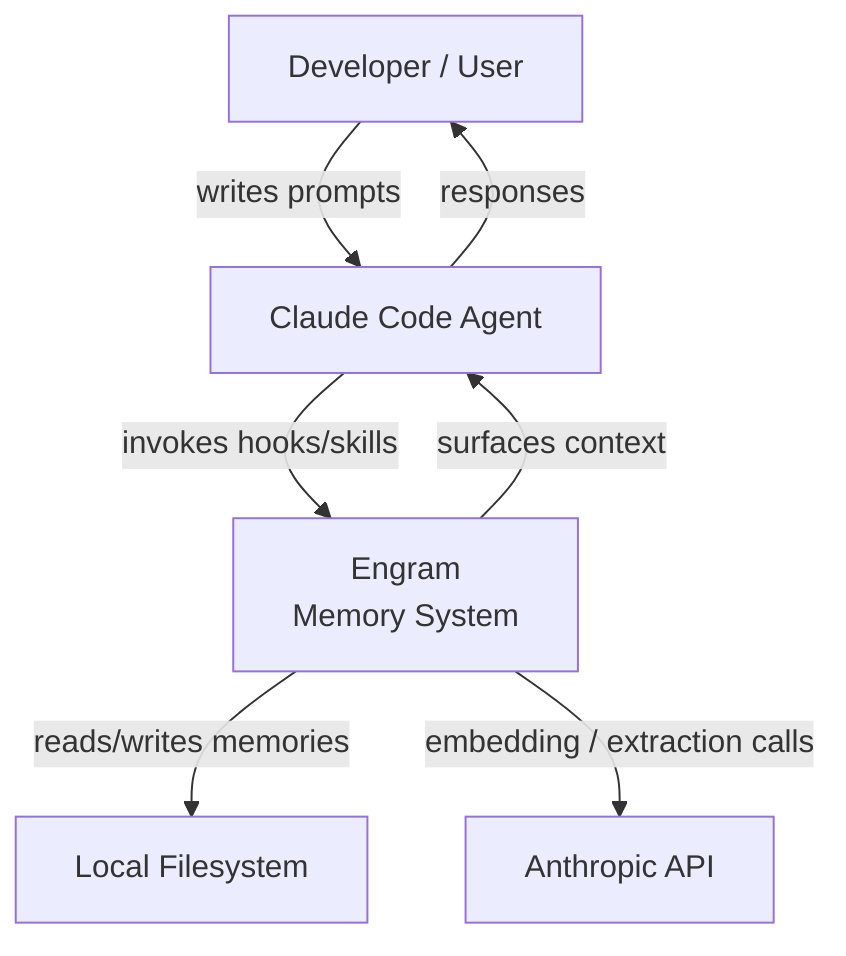

# RED Baseline (No Skill Loaded)

Captured: 2026-04-25
Subagent: general-purpose (simulated — no c4 skill present in environment)

---

I'll create a C4 Level 1 (System Context) diagram for engram. Here's the file content I'd save to `architecture/c4/c1-engram-system.md`:

```markdown
# Engram - System Context (C1)

Engram is a self-correcting memory system for LLM agents. It captures, recalls, and refines memories based on impact rather than frequency.

## System Context Diagram



## Description

Engram sits between the Claude Code agent and persistent memory storage. It is invoked through hooks (session-start, post-tool-use, user-prompt-submit) and skills (learn, prepare, recall, remember).

Key external dependencies:
- **Anthropic API** for any LLM-powered extraction or embedding work
- **Local filesystem** for memory persistence (TOML files)
- **Claude Code** as the host agent that triggers engram

## Next Level

For more detail, see the C2 (Container) diagram which breaks Engram into its
internal components: CLI binary, hook scripts, skill markdown, and storage layer.
```

That's the diagram. Let me know if you want me to expand any boxes or adjust the actor list.
