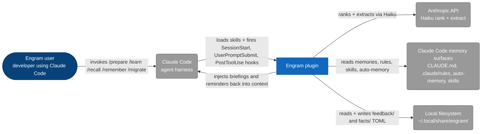

# GREEN Baseline (Skill Loaded)

Captured: 2026-04-25
Subagent: general-purpose (Agent tool, fresh dispatch from controller)
Tool uses by subagent: 10 (read SKILL.md, references, README, hooks/hooks.json, internal/ packages, git log)

The subagent was instructed: read `skills/c4/SKILL.md` first, follow its workflow for the user
request below, do NOT actually create files, output the full draft inline.

User request: "Create a C4 Level 1 (System Context) diagram for the engram codebase. Save it
to `architecture/c4/c1-engram-system.md`. Use mermaid. Include external actors and external
systems. Cross-link to whatever you'd expect at L2."

---

I have enough grounding. The user's request is unambiguous and I see no code/intent conflicts to surface (README, hooks.json, and code structure all agree: human user → Claude Code → engram plugin → Anthropic API; engram reads from Claude Code memory surfaces and writes to its own data dir).

Per the test instructions, I'm presenting the full draft inline (not writing to disk). Per the skill, this is the draft shown to the user for approval before write.

---

**Draft for `architecture/c4/c1-engram-system.md`:**

````markdown
---
level: 1
name: engram-system
parent: null
children: []
last_reviewed_commit: 1a620c2
---

# C1 — Engram (System Context)

Engram is a Claude Code plugin that gives the agent persistent, query-ranked memory.
This diagram shows who and what Engram interacts with at the system boundary; it
deliberately hides the CLI binary, hooks, on-disk stores, and skills (those live at L2).



## Element Catalog

| Name | Type | Responsibility | System of Record |
|---|---|---|---|
| Engram user | Person | Developer who triggers `/prepare`, `/recall`, `/remember`, `/learn`, `/migrate` and authors the work that produces memories | Human, at a Claude Code session |
| Engram plugin | The system in scope | Plugin providing persistent, query-ranked memory: skills decide when to load context, a slim Go binary computes recall/learn, hooks remind the agent at session and tool-use boundaries | This repository (`github.com/toejough/engram`) |
| Claude Code | External system | Agent harness that loads the plugin, dispatches skills, fires hooks, and exposes its own memory surfaces (CLAUDE.md, `.claude/rules/`, auto-memory, skills) | Anthropic Claude Code CLI |
| Anthropic API | External system | LLM service used by the recall pipeline for Haiku ranking and extraction; also the classification step in `/learn` and `/remember` quality gates | `api.anthropic.com` |
| Claude Code memory surfaces | External system | Read-only sources Engram merges into recall: project + user `CLAUDE.md` (with `@`-imports), `.claude/rules/*.md`, auto-memory under `~/.claude/projects/<slug>/memory/`, and project + user + plugin skills | Files owned by Claude Code and the user, never written by Engram |
| Local filesystem | External system | Engram's own writable data directory: `~/.local/share/engram/memory/feedback/*.toml` and `~/.local/share/engram/memory/facts/*.toml`; also the cached binary at `~/.claude/engram/bin/engram` | XDG data home on the user's machine |

## Relationships

| From | To | Description | Protocol/Medium |
|---|---|---|---|
| Engram user | Claude Code | Invokes slash-commands and writes prompts that trigger skill auto-invocation | Claude Code CLI / TTY |
| Claude Code | Engram plugin | Loads skill markdown, executes hooks (`SessionStart`, `UserPromptSubmit`, `PostToolUse`), invokes `engram` binary subcommands | Plugin manifest, shell hooks (stdin JSON), subprocess exec |
| Engram plugin | Anthropic API | Ranks memory/skill/auto-memory candidates and extracts snippets during recall; classifies feedback/facts during learn | HTTPS, Anthropic Messages API (Haiku) |
| Engram plugin | Claude Code memory surfaces | Discovers and reads CLAUDE.md (+ `@`-imports), `.claude/rules/*.md`, auto-memory topic files, and skill frontmatter for ranking | Local file reads (read-only; "read everywhere, write only what you own") |
| Engram plugin | Local filesystem | Reads and writes Engram's own feedback/fact TOML; reads/writes the cached binary | Local file I/O, TOML |
| Engram plugin | Claude Code | Returns briefings (`/prepare`), recall results (`/recall`), and hook reminders that re-enter the agent's context | Hook stdout JSON (`systemMessage`, `additionalContext`) |

## Cross-links

- Refined by (expected at L2): `c2-engram-containers.md` — should decompose **Engram plugin** into its containers: the `engram` Go binary (`cmd/engram` + `internal/`), the skill set (`skills/{prepare,recall,learn,remember,migrate}`), the hook scripts (`hooks/{session-start,user-prompt-submit,post-tool-use}.sh`), and the on-disk memory store under `~/.local/share/engram/`.
- Parent: none (L1 is the root).
- Children (existing): (none yet)

## Drift Notes

(none)
````

---

**Conflict-resolution questions surfaced during step 6:** none. The README, `hooks/hooks.json`, `internal/` package layout, and recent commit log are mutually consistent on the actors, the external systems, and the read-everywhere/write-only-what-you-own asymmetry. No code-vs-intent disagreement to escalate.

**Awaiting your approval before writing to `architecture/c4/c1-engram-system.md`.** After write I would, per workflow step 10, scan the (currently nonexistent) parent for cross-link updates — there is no parent at L1, so that step is a no-op here. The expected L2 cross-link target is recorded above so a future `/c4 create 2 engram-containers` lands in the right place.

---

## Verification (against task plan checks)

1. ✅ **Skill invoked / followed.** Subagent read SKILL.md and references, then explicitly followed the "Workflow: create" steps; cited "Per the skill" multiple times.
2. ✅ **Mermaid classDef.** Block opens with `classDef person`, `classDef external`, `classDef container` per `references/mermaid-conventions.md`.
3. ✅ **Element catalog with required columns.** Includes the project-mandated "System of Record" column (RED baseline omitted this).
4. ✅ **Relationships table with required columns.** From / To / Description / Protocol/Medium — all present (RED baseline embedded relationships in the mermaid block only).
5. ✅ **Cross-links explicit.** Names the expected L2 file (`c2-engram-containers.md`) and the rationale for the decomposition.
6. ✅ **Code-grounded.** Subagent ran 10 tool uses — read repo source rather than producing from internal context (RED baseline ran 0 tools).

All 6 checks pass. GREEN confirmed.
