# Target State Machine — All States Explicit

Every LLM action (skill invocation) and every decision point is its own state.
No hidden sub-states. The pair loop is expressed as explicit transitions.

This is the **target design**. Initial TOML implementation will use the
current-but-cleaned-up workflows. Phase 3 issues (138, 148, 140, 142)
become TOML-only changes. ISSUE-145 dropped.

## Terminology

| Term | Example | Meaning |
|------|---------|---------|
| **Issue** | ISSUE-150 | External tracking item — why we're doing work |
| **State** | `pm_produce`, `pm_decide` | A single step in the workflow — one action or decision |
| **Work item** | ITEM-003 from work-items.md | An implementation unit from breakdown — gets its own worktree, flows through TDD |
| **Progress entry** | Claude TaskList | User-visible progress tracking — maps to states and work items |

**Naming convention in this diagram:** States in the work item execution section use
`item_` prefix (not `task_`). The `scoped` workflow tier (formerly `task`) routes
single work items directly into TDD. "Task" is reserved for Claude's TaskList.

```mermaid
stateDiagram-v2
    direction TB

    %% ============================================
    %% INTAKE (shared entry point)
    %% ============================================
    [*] --> intake_evaluate : /project invoked

    intake_evaluate : intake-evaluator [haiku]

    intake_evaluate --> tasklist_create : classification returned

    tasklist_create : (auto) Create phase-level progress entries (ISSUE-142)

    tasklist_create --> route_workflow : TaskList ready

    state route_workflow <<choice>>
    route_workflow --> plan_produce : new
    route_workflow --> align_plan_produce : align
    route_workflow --> item_select : scoped

    %% ============================================
    %% NEW WORKFLOW — Plan Phase (ISSUE-138)
    %% ============================================
    state "PLAN PHASE" as plan_phase {
        plan_produce : plan-producer [opus] — structured plan conversation
        plan_produce --> plan_approve : plan drafted

        note right of plan_produce
            Single conversation covering:
            1. Problem space
            2. UX solution space
            3. Implementation solution space
            Replaces 3 separate interviews.
        end note

        plan_approve : (user gate) Review and approve plan
        plan_approve --> plan_produce : user requests changes
    }

    plan_approve --> artifact_fork : plan approved

    %% ============================================
    %% PARALLEL ARTIFACT PRODUCTION (ISSUE-138)
    %% ============================================
    state "PARALLEL ARTIFACTS" as parallel_artifacts {

        state artifact_fork <<fork>>

        artifact_fork --> pm_produce : requirements
        artifact_fork --> design_produce : design
        artifact_fork --> arch_produce : architecture

        note right of artifact_fork
            Agents communicate via SendMessage
            to align on shared concepts and
            negotiate trace links together.
        end note

        pm_produce : pm-producer [sonnet] — requirements.md
        design_produce : design-producer [sonnet] — design.md
        arch_produce : arch-producer [sonnet] — architecture.md

        state artifact_join <<join>>
        pm_produce --> artifact_join : requirements.md done
        design_produce --> artifact_join : design.md done
        arch_produce --> artifact_join : architecture.md done
    }

    artifact_join --> crosscut_qa : all artifacts ready

    state "CROSS-CUTTING QA" as crosscut {
        crosscut_qa : qa [haiku] — validate all 3 artifacts for consistency + traces
        crosscut_qa --> crosscut_decide : verdict returned

        state crosscut_decide <<choice>>
        crosscut_decide --> artifact_fork : improvement-request (re-run affected producers)
        crosscut_decide --> artifact_commit : approved
        crosscut_decide --> phase_blocked : unrecoverable
    }

    artifact_commit : (auto) Commit requirements.md + design.md + architecture.md
    artifact_commit --> breakdown_produce : committed

    %% ============================================
    %% BREAKDOWN PHASE
    %% ============================================
    state "BREAKDOWN" as breakdown_phase {
        breakdown_produce : breakdown-producer [sonnet] — work-items.md
        breakdown_qa : qa [haiku] — validate work-items.md
        breakdown_decide : (auto) Evaluate QA verdict

        breakdown_produce --> breakdown_qa : producer complete
        breakdown_qa --> breakdown_decide : QA verdict returned

        state breakdown_decide <<choice>>
        breakdown_decide --> breakdown_produce : improvement-request
        breakdown_decide --> breakdown_commit : approved
        breakdown_decide --> phase_blocked : unrecoverable
    }
    breakdown_commit : (auto) Commit work-items.md
    breakdown_commit --> item_select : committed

    %% ============================================
    %% WORK ITEM EXECUTION (shared by new + scoped)
    %% ============================================
    state "WORK ITEM EXECUTION" as item_exec {
        item_select : (auto) Evaluate work item graph, identify unblocked items

        state item_fork <<fork>>
        item_select --> item_fork : N items unblocked

        note right of item_fork
            Each unblocked work item gets its own
            worktree and runs TDD independently.
            1 item = sequential, N items = parallel.
            Each produce state includes item context (ISSUE-140).
        end note

        item_fork --> worktree_create : per item

        %% ============================================
        %% PER-ITEM LIFECYCLE
        %% ============================================
        state "PER-ITEM LIFECYCLE" as item_lifecycle {

            worktree_create : (auto) Create git worktree + branch for work item

            worktree_create --> tdd_loop : worktree ready

            state "TDD LOOP" as tdd_loop {

                state "TDD RED" as tdd_red {
                    tdd_red_produce : tdd-red-producer [sonnet] — write failing tests
                    tdd_red_qa : qa [haiku] — validate tests
                    tdd_red_decide : (auto) Evaluate QA verdict

                    tdd_red_produce --> tdd_red_qa : producer complete
                    tdd_red_qa --> tdd_red_decide : QA verdict returned

                    state tdd_red_decide <<choice>>
                    tdd_red_decide --> tdd_red_produce : improvement-request
                    tdd_red_decide --> tdd_green_produce : approved
                    tdd_red_decide --> item_escalated : unrecoverable
                }

                state "TDD GREEN" as tdd_green {
                    tdd_green_produce : tdd-green-producer [sonnet] — make tests pass
                    tdd_green_qa : qa [haiku] — validate implementation
                    tdd_green_decide : (auto) Evaluate QA verdict

                    tdd_green_produce --> tdd_green_qa : producer complete
                    tdd_green_qa --> tdd_green_decide : QA verdict returned

                    state tdd_green_decide <<choice>>
                    tdd_green_decide --> tdd_green_produce : improvement-request
                    tdd_green_decide --> tdd_refactor_produce : approved
                    tdd_green_decide --> item_escalated : unrecoverable
                }

                state "TDD REFACTOR" as tdd_refactor {
                    tdd_refactor_produce : tdd-refactor-producer [sonnet] — refactor
                    tdd_refactor_qa : qa [haiku] — validate refactored code
                    tdd_refactor_decide : (auto) Evaluate QA verdict

                    tdd_refactor_produce --> tdd_refactor_qa : producer complete
                    tdd_refactor_qa --> tdd_refactor_decide : QA verdict returned

                    state tdd_refactor_decide <<choice>>
                    tdd_refactor_decide --> tdd_refactor_produce : improvement-request
                    tdd_refactor_decide --> tdd_commit : approved
                    tdd_refactor_decide --> item_escalated : unrecoverable
                }

                tdd_commit : (auto) Commit work item in worktree
                item_escalated : (auto) Non-blocking ask user, mark item waiting

            }

            tdd_commit --> merge_acquire : item complete
            item_escalated --> item_parked : ask user (non-blocking)

                    item_parked : (auto) Work item parked — worktree kept, waiting for user

            note right of item_escalated
                Non-blocking: ask user via AskUserQuestion
                but do NOT wait. Other items keep running.
                If user responds later → re-enter TDD loop
                in the existing worktree.
                If user never responds → worktree cleaned up
                at items_done, included in evaluation.
            end note

            %% ============================================
            %% MERGE MUTEX (serialized across all items)
            %% ============================================
            merge_acquire : (auto) Acquire merge lock (wait if held)

            note right of merge_acquire
                Only one item can rebase/merge
                at a time. Others wait here.
            end note

            merge_acquire --> rebase : lock acquired
            rebase : (auto) Rebase item branch onto main
            rebase --> merge : rebase clean
            merge : (auto) Fast-forward merge to main
            merge --> worktree_cleanup : merged

            worktree_cleanup : (auto) Delete worktree + branch, release lock

        }

        state item_join <<join>>
        worktree_cleanup --> item_join : item merged
        item_parked --> item_join : item parked

        item_assess : (auto) Re-evaluate work item graph

        item_join --> item_assess : an item finished or parked

        state item_assess <<choice>>
        item_assess --> item_select : newly unblocked items available
        item_assess --> items_done : all non-escalated items done
        item_assess --> tdd_loop : user responded to escalation (retry item)
    }

    items_done : (auto) All completable items done (escalated items unresolved)

    note right of items_done
        Escalated items with no user response
        are carried forward as unresolved.
        Their worktrees are cleaned up here.
        Evaluation interview covers them.
    end note

    items_done --> documentation_produce

    %% ============================================
    %% DOCUMENTATION (all workflows with work items)
    %% ============================================
    state "DOCUMENTATION" as doc_phase {
        documentation_produce : doc-producer [sonnet] — project docs
        documentation_qa : qa [haiku] — validate docs
        documentation_decide : (auto) Evaluate verdict

        documentation_produce --> documentation_qa : complete
        documentation_qa --> documentation_decide : verdict

        state documentation_decide <<choice>>
        documentation_decide --> documentation_produce : improvement
        documentation_decide --> documentation_commit : approved
        documentation_decide --> phase_blocked : unrecoverable
    }
    documentation_commit : (auto) Commit docs
    documentation_commit --> evaluation_produce : committed

    %% ============================================
    %% ALIGN WORKFLOW (parallel, mirrors new project)
    %% ============================================
    state "ALIGN PLAN PHASE" as align_plan_phase {
        align_plan_produce : align-plan-producer [opus] — explore + plan alignment

        note right of align_plan_produce
            Single conversation covering:
            1. Explore current code state
            2. Compare against existing docs
            3. Identify gaps and drift
            4. Plan what each doc needs
        end note

        align_plan_produce --> align_plan_approve : plan drafted

        align_plan_approve : (user gate) Review alignment plan
        align_plan_approve --> align_plan_produce : user requests changes
    }

    align_plan_approve --> align_infer_fork : plan approved

    state "PARALLEL INFERENCE" as align_parallel {

        state align_infer_fork <<fork>>

        align_infer_fork --> align_infer_reqs_produce : requirements
        align_infer_fork --> align_infer_design_produce : design
        align_infer_fork --> align_infer_arch_produce : architecture
        align_infer_fork --> align_infer_tests_produce : tests

        note right of align_infer_fork
            Agents communicate via SendMessage
            to align on what docs belong where
            and negotiate traceability together.
        end note

        align_infer_reqs_produce : pm-infer-producer [sonnet] — requirements.md
        align_infer_design_produce : design-infer-producer [sonnet] — design.md
        align_infer_arch_produce : arch-infer-producer [sonnet] — architecture.md
        align_infer_tests_produce : tdd-red-infer-producer [sonnet] — tests

        state align_infer_join <<join>>
        align_infer_reqs_produce --> align_infer_join : requirements.md done
        align_infer_design_produce --> align_infer_join : design.md done
        align_infer_arch_produce --> align_infer_join : architecture.md done
        align_infer_tests_produce --> align_infer_join : tests inferred
    }

    align_infer_join --> align_crosscut_qa : all artifacts ready

    state "ALIGN CROSS-CUTTING QA" as align_crosscut {
        align_crosscut_qa : qa [haiku] — validate all inferred artifacts for consistency + traces
        align_crosscut_qa --> align_crosscut_decide : verdict returned

        state align_crosscut_decide <<choice>>
        align_crosscut_decide --> align_infer_fork : improvement-request (re-run affected producers)
        align_crosscut_decide --> align_artifact_commit : approved
        align_crosscut_decide --> phase_blocked : unrecoverable
    }

    align_artifact_commit : (auto) Commit aligned artifacts
    align_artifact_commit --> evaluation_produce : committed

    %% ============================================
    %% PHASE-LEVEL ESCALATION (serial phases only)
    %% ============================================
    phase_blocked : (auto) Phase blocked — announce and wait for user

    note right of phase_blocked
        Serial phase escalation (PM, Design, Breakdown, etc.)
        blocks everything downstream. Announce-and-proceed
        with one extra attempt first, but if truly stuck,
        wait for user guidance: fix + continue, skip, or abort.
        Different from item_escalated which is non-blocking.
    end note

    %% ============================================
    %% CONSOLIDATED EVALUATION (ISSUE-148)
    %% Replaces separate retro + summary phases
    %% ============================================
    state "EVALUATION" as eval_phase {
        evaluation_produce : evaluation-producer [sonnet] — consolidated retro + summary

        note right of evaluation_produce
            Evaluates: project summary, problems,
            improvements, model assignments,
            phase value, tool errors, determinism
            opportunities, offloading candidates,
            unresolved escalations.
        end note

        evaluation_produce --> evaluation_interview : findings ready

        evaluation_interview : (user gate) Present findings to user by tier
        note right of evaluation_interview
            Tier 1: Quick wins (approve/reject)
            Tier 2: Process changes (discuss)
            Tier 3: Strategic opportunities
            User chooses which become issues.
        end note

        evaluation_interview --> evaluation_commit : user approved findings
    }
    evaluation_commit : (auto) Commit evaluation.md + create approved issues
    evaluation_commit --> issue_update : committed

    %% ============================================
    %% WRAP-UP
    %% ============================================
    issue_update : (auto) Update linked issue status
    issue_update --> next_steps : done

    next_steps : next-steps [haiku] — suggest follow-up work
    next_steps --> [*] : complete
```

## Annotation Legend

| Prefix | Meaning |
|--------|---------|
| `skill-name [model]` | LLM-driven state — spawns agent running the named skill on the specified model |
| `(auto)` | Deterministic state — no LLM, handled by projctl or the orchestrator mechanically |
| `(user gate)` | Blocks until user approves/responds |

## Progress Entry Lifecycle (Claude TaskList)

Progress entries give the user visibility into what's happening. They map to the state machine:

| When | Action | Example |
|------|--------|---------|
| `tasklist_create` | Create phase-level entries for the workflow | "PM phase", "Design phase", "Breakdown", "Implementation", "Documentation", "Evaluation" |
| Any `*_produce` state entered | Mark that phase's entry `in_progress` | "PM phase" → in_progress |
| `*_commit` for that phase | Mark that phase's entry `completed` | "PM phase" → completed |
| `item_select` identifies items | Create work-item-level entries | "ITEM-001: Add auth", "ITEM-002: Add logging" |
| `worktree_create` for an item | Mark item entry `in_progress` | "ITEM-001" → in_progress |
| `worktree_cleanup` for an item | Mark item entry `completed` | "ITEM-001" → completed |
| `item_parked` for an item | Mark item entry as blocked/waiting | "ITEM-001" → parked |
| `phase_blocked` | Mark current phase entry as blocked | "Breakdown" → blocked |

## State Types

| Type             | Example                | What happens                                                                                                    |
| ---------------- | ---------------------- | --------------------------------------------------------------------------------------------------------------- |
| **Produce**      | `pm_produce`           | Spawn producer agent to run skill, write artifact. Inside item execution, includes work item context (ISSUE-140). |
| **QA**           | `pm_qa`                | Spawn QA agent to validate artifact against contract |
| **Cross-cut QA** | `crosscut_qa`          | Single QA pass validating multiple artifacts for consistency (ISSUE-138) |
| **Decide**       | `pm_decide`            | State machine evaluates QA verdict — routes to improvement, approved, or escalation (no LLM needed) |
| **Commit**       | `pm_commit`            | Run `/commit` to persist artifact |
| **Plan**         | `plan_produce`         | Interactive plan conversation with user (ISSUE-138) |
| **Approve**      | `plan_approve`         | User reviews and approves plan |
| **TaskList**     | `tasklist_create`      | Create Claude TaskList progress entries (ISSUE-142) |
| **Select**       | `item_select`          | Evaluate work item graph, identify unblocked items |
| **Fork**         | `item_fork`            | Spawn parallel item lifecycles, one per unblocked work item |
| **Worktree**     | `worktree_create`      | Create git worktree + branch for a work item |
| **Lock**         | `merge_acquire`        | Acquire merge mutex (serializes rebase/merge across items) |
| **Rebase**       | `rebase`               | Rebase item branch onto main |
| **Merge**        | `merge`                | Fast-forward merge item branch to main |
| **Cleanup**      | `worktree_cleanup`     | Delete worktree + branch, release merge lock |
| **Join**         | `item_join`            | A parallel item completed — re-evaluate graph |
| **Assess**       | `item_assess`          | Check if newly unblocked or all done (no LLM needed) |
| **Escalate (item)** | `item_escalated`    | Non-blocking ask to user; item parked, other items continue |
| **Escalate (phase)** | `phase_blocked`     | Serial phase blocked — announce-and-proceed, then wait if truly stuck |
| **Interview**    | `evaluation_interview` | Present findings + unresolved escalations to user (ISSUE-148) |
| **Route**        | `route_workflow`       | Route based on intake classification |
| **Action**       | `issue_update`         | Run a non-artifact action |

## Phase 3 issues mapped to diagram

| Issue     | What it adds to the diagram                                                | Type of change                     |
| --------- | -------------------------------------------------------------------------- | ---------------------------------- |
| ISSUE-138 | `plan_produce` → `plan_approve` → parallel `artifact_fork` → `crosscut_qa` | New phases + fork/join             |
| ISSUE-148 | `evaluation_produce` → `evaluation_interview` replaces retro + summary     | Phase merge                        |
| ISSUE-140 | Work item ID automatically included in produce states during item execution | Context enrichment (no new states) |
| ISSUE-142 | `tasklist_create` after intake, before workflow routing                    | New state                          |
| ISSUE-145 | Dropped — never ask about continuing vs deferring. Always continue.        | Removed                            |

## Key design principles

**No hidden sub-states.** Every state is visible in the TOML transition graph.
The `pairs` section of state.toml is eliminated.

**Merge-as-you-go.** Each work item rebases and merges to main as it completes.
Later items rebase onto latest main. Catches integration issues early.

**Serialized merging via mutex.** Prevents concurrent rebase/merge races.

**Per-item state tracking.** Each parallel work item has its own state within the lifecycle:

- `items[id].state` — which TDD/merge state this item is in
- `items[id].worktree` — path to git worktree
- `items[id].branch` — branch name

**Two escalation levels.** Item-level (`item_escalated`): non-blocking, item parked,
other items continue. Phase-level (`phase_blocked`): serial phase stuck, blocks
everything downstream, announce-and-proceed then wait for user.

**Never stall on operational decisions.** Only plan approval and evaluation
interview are blocking user gates. Item escalations are non-blocking — ask the user
but keep working. Always prefer parallel over serial. Always continue over stopping.

**Non-blocking item escalation.** When a work item is unrecoverable, ask the user
via AskUserQuestion but don't wait. Park the item, keep its worktree. If the user
responds before the project ends, retry the item. If they don't, clean up the
worktree at `items_done` and include escalations in the evaluation interview.

## Workflow summaries

**NEW:** intake → tasklist → plan → parallel(pm + design + arch) → cross-cut QA → breakdown → item execution → documentation → evaluation → wrap-up

**SCOPED:** intake → tasklist → item execution → documentation → evaluation → wrap-up

**ALIGN:** intake → tasklist → align-plan → parallel(infer-reqs + infer-design + infer-arch + infer-tests) → cross-cut QA → evaluation → wrap-up
